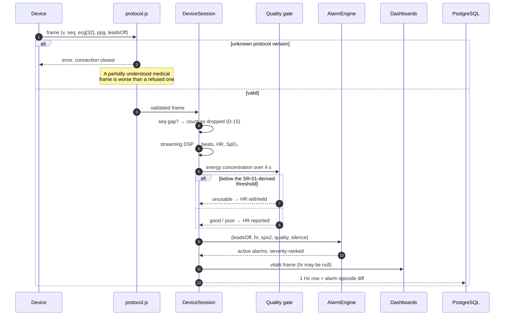
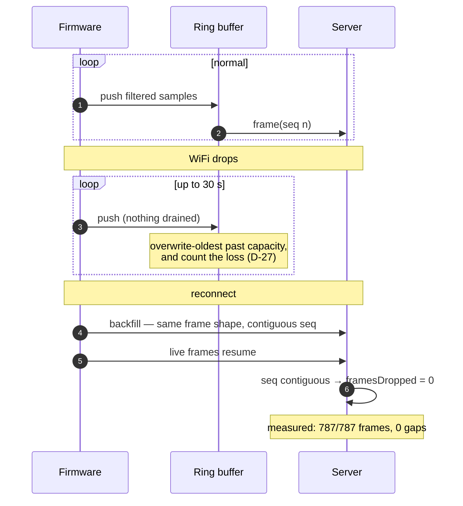
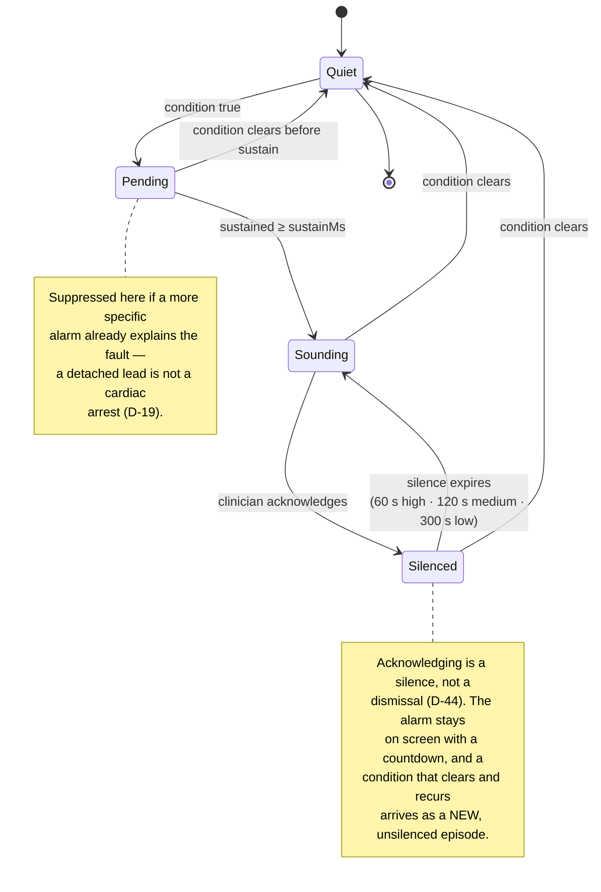

# System design

Diagrams for the parts of this system that are hard to hold in your head from the code:
what talks to what, what happens in which order, and what state an alarm is in. Everything
here is Mermaid, so it renders on GitHub and lives next to the code it describes rather
than in a drawing tool nobody opens.

The set is deliberately small. A diagram earns its place by showing something the source
does not — a boundary, an ordering, or a state machine spread across several files. There
is no class diagram here, because the classes are legible where they are defined.

---

## 1. System context

Who and what the system touches, and where the boundary of "the device" actually falls.

```mermaid
graph TB
    subgraph Patient
        P["Patient<br/>ECG · PPG · temperature"]
    end

    subgraph Acquisition["Acquisition device — ESP32"]
        AFE["Analog front end<br/>AD8232 · gain 330 · 0.5–40 Hz"]
        ADC["ADC<br/>12-bit · 360 Hz"]
        FW["Firmware<br/>notch · leads-off · ring buffer · framing"]
    end

    subgraph Server["Ingest server — Node.js"]
        DSP["Streaming DSP<br/>bandpass · Pan-Tompkins · vitals"]
        Q["Signal quality<br/>SR-07 gate"]
        AL["Alarm engine"]
        ST[("PostgreSQL<br/>optional")]
    end

    subgraph Clinical["Clinical users"]
        BED["Bedside display"]
        CS["Central station"]
    end

    P -->|"electrodes, finger clip"| AFE
    AFE --> ADC --> FW
    FW -->|"WebSocket · protocol v2<br/>framed blocks with seq"| DSP
    DSP --> Q --> AL
    AL --> ST
    AL -->|"WebSocket fan-out"| BED
    AL --> CS
    CS -->|"acknowledge"| AL

    SIM["sim/replay.py<br/>MIT-BIH through the AFE model"] -.->|"same protocol,<br/>no hardware"| DSP

    style Acquisition fill:#1a2430,stroke:#35d07f
    style Server fill:#1a2430,stroke:#35c8e8
    style SIM fill:#2a2430,stroke:#e8c135,stroke-dasharray: 4 3
```

The dashed path is the one that matters for this project's build order: the simulator
speaks the same protocol as the firmware, so everything to the right of the device
boundary has been exercised end to end without a board existing (D-01, D-24).

---

## 2. Where the work happens, and why there

The **thin edge / smart server** split (D-03). The rule: anything that must be
deterministic and local stays on the device; anything that benefits from being
regression-tested against recordings moves to the server.

```mermaid
graph LR
    subgraph Device["On the device — deterministic, local"]
        direction TB
        S["Timer-ISR sampling<br/>360 Hz, core 1 (D-29)"]
        N["50 Hz notch<br/>Q14 fixed point"]
        L["Leads-off<br/>LO pins + rail check (D-28)"]
        B["Ring buffer<br/>30 s, overwrite-oldest (D-27)"]
        S --> N --> B
        S --> L
    end

    subgraph Srv["On the server — testable against recordings"]
        direction TB
        BP["0.5–40 Hz display band<br/>5–15 Hz detection band (D-07)"]
        PT["Pan-Tompkins<br/>adaptive threshold, search-back"]
        V["Vitals<br/>median of instantaneous rates (D-09)"]
        SPO["SpO₂<br/>ratio of ratios (protocol v2)"]
        QG["Quality gate<br/>threshold from SR-01 (D-35)"]
        BP --> PT --> V --> QG
        SPO --> QG
    end

    Device -->|"raw counts → mV,<br/>plus red/IR"| Srv

    style Device fill:#1a2430,stroke:#35d07f
    style Srv fill:#1a2430,stroke:#35c8e8
```

The same filter design generates the firmware's C coefficients, the server's JavaScript
module and the Python reference (D-12), and all three are scored on the same recordings
(D-13, D-25, D-38) — so the split costs no consistency.

---

## 3. A frame arriving

The normal path, showing where a frame can be refused and where a number can be withheld.

Note step 5: the quality gate sits *between* deriving a number and reporting it. Until
Phase 5 it existed only in Python and the server never called it, which is how the shipped
monitor reported 102 wrong heart rates on a swamped signal while its component tests all
passed (D-49).

---

## 4. An electrode falls off and comes back

The sequence behind the project's worst bug, and the guards that now sit in it.

```mermaid
sequenceDiagram
    autonumber
    participant E as Electrode
    participant F as Firmware
    participant S as Server
    participant A as AlarmEngine
    participant U as Display

    E-->>F: contact lost
    F->>F: LO pins high AND rail detected
    Note over F: 50 ms assert debounce (D-28)<br/>inside SR-03's 2 s budget
    F->>S: frames with leadsOff = true
    S->>A: leadsOff
    Note over A: 1.5 s debounce (D-18)
    A->>U: LEADS_OFF · high
    U->>U: HR, SpO₂, temp withdrawn to "--" (D-23)

    E-->>F: contact restored
    F->>F: 500 ms de-assert debounce
    F->>S: leadsOff = false
    S->>S: detector.restart() — discard filter and threshold state
    S->>S: rollingHr.restart() — silence clock starts now (D-47)
    Note over S: 3 s settling: quality forced "unusable" (D-22)
    S->>U: no rate reported while settling
    S->>U: true rate resumes once settled

    rect rgb(60, 30, 30)
        Note over S,U: Without the settling window, the reconnection<br/>transient produced 190 bpm "tachycardia"<br/>with signal quality GOOD
    end
```

---

## 5. A network outage

SR-05. The device does the remembering, because it is the only component that still exists
when the link is gone.

---

## 6. Alarm lifecycle

One episode, from the condition arising to it clearing — including what acknowledging does
and does not do.

---

## 7. Verification structure

How a claim in this repository becomes checkable. The arrows are the ones CI follows.

```mermaid
graph TB
    UN["User needs<br/>UN-1 … UN-4"]
    SR["Requirements<br/>SR-01 … SR-08<br/><i>dsp/requirements.py</i>"]
    D["Design elements<br/>code, named per requirement"]

    subgraph Evidence
        MIT["MIT-BIH validation<br/><i>dsp/validate.py</i><br/>22,459 beats"]
        SC["Fault injection<br/><i>sim/run_scenarios.py</i><br/>8 scenarios, real time"]
        ST["Module self-tests<br/>191 Python · 74 C · 101 Node"]
        XL["Cross-language scoring<br/>Python ↔ JS ↔ C"]
    end

    GEN["<i>dsp/generate_requirements.py</i>"]
    DOC["docs/requirements.md<br/>status computed, never written"]
    VER["docs/verification.md<br/>generated, never hand-edited"]

    UN --> SR --> D
    SR --> GEN
    MIT --> GEN
    SC --> GEN
    ST --> GEN
    GEN --> DOC
    MIT --> VER
    SC --> VER
    XL --> VER

    style Evidence fill:#1a2430,stroke:#35c8e8
    style DOC fill:#1a2430,stroke:#35d07f
    style VER fill:#1a2430,stroke:#35d07f
```

The property this buys: a requirement whose evidence has never been produced renders as
*not yet measured*, and one whose evidence says it failed **cannot** render as passing,
because the generator has no way to express that (D-50).
