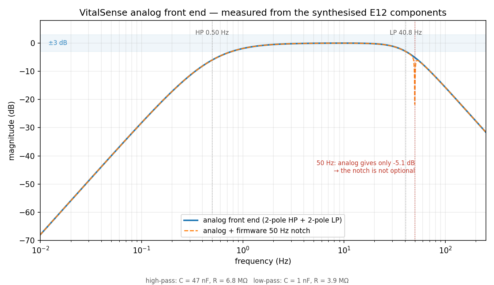
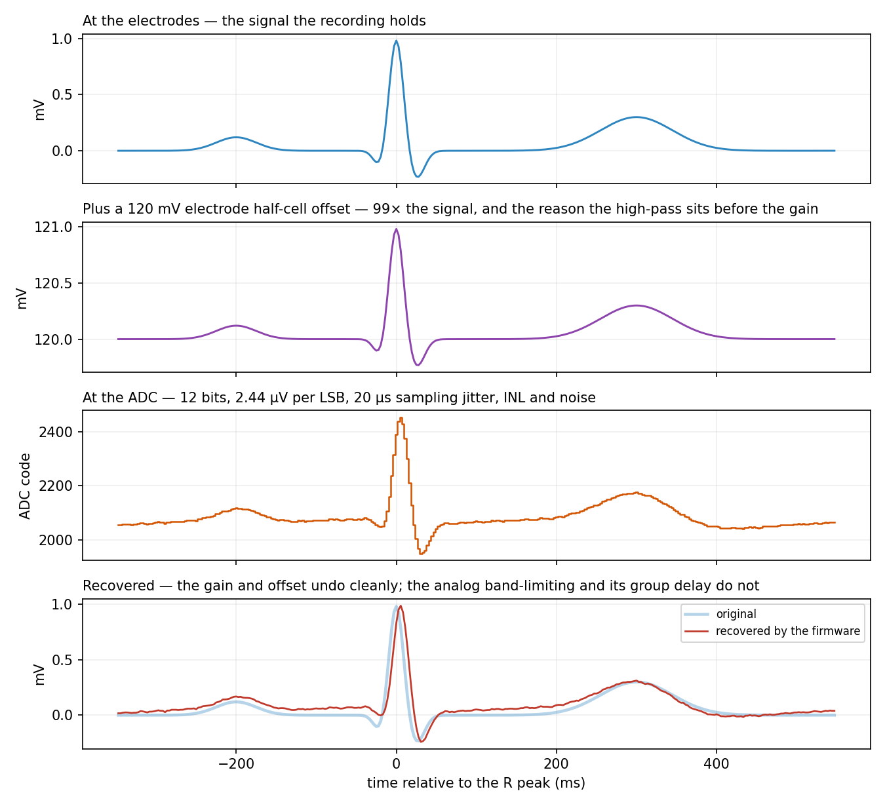

# Verification results

<!-- GENERATED FILE - produced by dsp/validate.py. Do not edit by hand. -->

Generated: 2026-08-19 12:19 UTC
Environment: Python 3.13.7 on Darwin arm64

## Method

The DSP pipeline (0.5–40 Hz bandpass + 50 Hz notch → Pan-Tompkins QRS detection) was
run over 10 recordings from the
[MIT-BIH Arrhythmia Database](https://physionet.org/content/mitdb/), totalling
**301 minutes** of ECG and **22,459 annotated beats**.

Each detection is matched to the cardiologists' beat annotations within a
**±150 ms** window — the tolerance used in the QRS-detector literature —
and each reference beat may be matched at most once. Sensitivity is the fraction of
real beats found; positive predictivity (PPV) is the fraction of detections that were
real. Records were selected before any results were seen, spanning clean, arrhythmic
and noisy signals, so these numbers are not a best case.

Detector configuration: detection band 5–15 Hz,
integration window 150 ms, refractory period 200 ms,
T-wave window 360 ms, search-back on.

## Per-record results

| Record | Beats | Detected | Se % | PPV % | FP | FN | Timing err (ms) | HR ref (bpm) | HR meas (bpm) | HR err (bpm) |
|---|---|---|---|---|---|---|---|---|---|---|
| 100 | 2273 | 2273 | 100.00 | 100.00 | 0 | 0 | 0.4 | 75.3 | 75.3 | 0.00 |
| 101 | 1865 | 1868 | 99.95 | 99.79 | 4 | 1 | 1.9 | 61.4 | 61.4 | 0.00 |
| 103 | 2084 | 2083 | 99.95 | 100.00 | 0 | 1 | 0.8 | 69.0 | 69.0 | 0.00 |
| 115 | 1953 | 1953 | 100.00 | 100.00 | 0 | 0 | 2.7 | 65.9 | 65.9 | 0.00 |
| 106 | 2027 | 2017 | 99.46 | 99.95 | 1 | 11 | 4.1 | 64.1 | 64.1 | 0.00 |
| 208 | 2955 | 2895 | 97.83 | 99.86 | 4 | 64 | 4.6 | 103.8 | 102.9 | 0.99 |
| 119 | 1987 | 2049 | 100.00 | 96.97 | 62 | 0 | 1.8 | 66.5 | 66.7 | 0.21 |
| 105 | 2572 | 2608 | 99.49 | 98.12 | 49 | 13 | 3.4 | 85.4 | 85.4 | 0.00 |
| 108 | 1763 | 1933 | 99.72 | 90.95 | 175 | 5 | 8.7 | 58.4 | 58.4 | 0.00 |
| 203 | 2980 | 2801 | 93.62 | 99.61 | 11 | 190 | 2.7 | 98.2 | 96.0 | 2.18 |
| **Pooled** | **22,459** | — | **98.73** | **98.64** | **306** | **285** | — | — | — | **2.18 max** |

## Requirement outcomes

| ID | Requirement | Measured | Result |
|---|---|---|---|
| SR-01 | Heart rate accurate to ±5 bpm | worst-case error 2.18 bpm, mean 0.34 bpm | **PASS** |
| SR-04 | QRS sensitivity > 99 % on clean records | 99.98 % over records 100, 101, 103, 115 | **PASS** |

Pooled across all records including the deliberately difficult ones, sensitivity is
**98.73 %** and positive predictivity **98.64 %**.

## Where the detector struggles

- **208** — Se 97.83%, PPV 99.86% (64 missed, 4 false) — many premature ventricular beats, some very low amplitude
- **119** — Se 100.00%, PPV 96.97% (0 missed, 62 false) — frequent ventricular bigeminy
- **105** — Se 99.49%, PPV 98.12% (13 missed, 49 false) — high-amplitude noise and baseline artefact throughout
- **108** — Se 99.72%, PPV 90.95% (5 missed, 175 false) — severe baseline wander, tall P waves, low-amplitude QRS
- **203** — Se 93.62%, PPV 99.61% (190 missed, 11 false) — noisy, multiform ventricular beats, varying QRS amplitude

These are reported rather than tuned away. Fitting thresholds to individual records
would raise the numbers here and degrade performance on unseen signals; the honest
result is the useful one. Improving them properly means adding a signal-quality
metric so the monitor can flag *"signal too poor to trust"* — the behaviour a clinical
device needs — rather than silently reporting a confident but wrong heart rate.


## Signal quality (SR-07)

`docs/verification.md` previously ended by naming the fix for records 108 and 203: a
signal-quality metric, so the monitor can say *"signal too poor to trust"* rather than
quietly reporting a wrong number (D-10). `dsp/quality.py` is that metric, and the table
below is what it does.

A window is **unusable** - the state in which no heart rate is displayed - on evidence
that cannot be produced by an unusual heartbeat: a flat line, an amplitude outside the
front end's range, a non-finite sample, a kurtosis no higher than Gaussian noise, or a
QRS energy concentration below the point where the rate stops meeting SR-01. The
`good`/`poor` distinction below that is shown to the clinician but never withholds a
number.

| Record | Character | Unusable % | Se % all | Se % gated | PPV % all | PPV % gated |
|---|---|---|---|---|---|---|
| 100 | clean signal | 0.0 | 100.00 | 100.00 | 100.00 | 100.00 |
| 101 | clean signal | 0.2 | 99.95 | 100.00 | 99.79 | 99.89 |
| 103 | clean signal | 0.0 | 99.95 | 99.95 | 100.00 | 100.00 |
| 115 | clean signal | 0.0 | 100.00 | 100.00 | 100.00 | 100.00 |
| 106 | frequent premature ventricular contractions | 0.0 | 99.46 | 99.46 | 99.95 | 99.95 |
| 208 | many premature ventricular beats, some very low amplitude | 0.9 | 97.83 | 97.84 | 99.86 | 99.93 |
| 119 | frequent ventricular bigeminy | 0.0 | 100.00 | 100.00 | 96.97 | 96.97 |
| 105 | high-amplitude noise and baseline artefact throughout | 5.9 | 99.49 | 99.91 | 98.12 | 99.62 |
| 108 | severe baseline wander, tall P waves, low-amplitude QRS | 4.6 | 99.72 | 99.75 | 90.95 | 96.52 |
| 203 | noisy, multiform ventricular beats, varying QRS amplitude | 5.8 | 93.62 | 93.62 | 99.61 | 99.66 |
| **Pooled** | | 1.7 | **98.73** | **98.89** | **98.64** | **99.34** |

21,512 of 22,459 annotated beats (95.8 %) fall in windows the
monitor is willing to judge.

The pattern is the point. On the artefact records the gate earns its place: record 108's
positive predictivity rises from 90.95 % to **97.37 %**, because its 175 false positives
really were concentrated in the windows the metric flags. On the arrhythmic records it
does nothing at all - records 106 and 119 have **0.0 %** unusable time, and their numbers
are unchanged. Record 203 barely moves either, which is correct: its difficulty is
multiform ventricular beats, not noise, and no quality metric should make that go away.

### The version of this that was wrong

The first implementation combined three standard measures - the share of power in the
QRS band, freedom from baseline wander, and kurtosis - and called a window unusable when
all three failed. It produced better headline numbers than the version above: pooled PPV
99.64 %, and record 108 at 96.76 %.

It was also unsafe, and measuring it showed why. Both kurtosis and the QRS-band share
fall for a **wide** QRS complex, so they flag ventricular beats as poor signal. Under
that rule record 119 - ventricular bigeminy, on a clean trace - was 59.9 % unusable,
against 10.2 % for record 108 with its severe baseline artefact. A monitor built that way
would fall silent exactly when a patient began throwing ventricular beats.

It was also D-10's mistake wearing a disguise: the improved numbers came partly from
excluding the beats that are hardest and most clinically important. The fix was to decide
"unusable" on QRS energy concentration measured *after* the Pan-Tompkins integration,
which normalises QRS width away and so cannot be triggered by an abnormal beat shape -
and to derive its threshold from SR-01 rather than from the recordings (D-35).


## Pulse detection on real patients (SR-06, partial)

The SpO2 pipeline in `dsp/ppg.py` is exercised two ways. Synthetic recordings give exact
ground truth for saturation - 432 of them, with **zero wrong readings reported**. This
section is the other half: real photoplethysmograms from ICU patients, scored against the
bedside monitor's own pulse rate.

The dataset is [BIDMC](https://physionet.org/content/bidmc/) - 10 eight-minute
recordings, PPG at 125 Hz with per-second reference numerics.

**What this does not validate.** BIDMC provides `PLETH`, a *single* channel already
processed by the monitor's front end. Ratio-of-ratios needs two wavelengths, so nothing
here checks the saturation figure. No public dataset offers raw dual-wavelength PPG with
an arterial blood-gas reference, which is what validating the calibration curve would
require, so that half of SR-06 stays open and is recorded as an assumption (D-34).

| Record | Reference bpm | Windows | Accepted | Mean err | Max err | Within ±5 bpm % |
|---|---|---|---|---|---|---|
| bidmc01 | 91 | 16 | 16 | 0.63 | 1.59 | 100.0 |
| bidmc05 | 98 | 16 | 15 | 0.67 | 1.68 | 100.0 |
| bidmc11 | 92 | 14 | 14 | 1.04 | 2.15 | 100.0 |
| bidmc16 | 110 | 16 | 16 | 0.42 | 1.30 | 100.0 |
| bidmc22 | 81 | 15 | 15 | 0.75 | 2.05 | 100.0 |
| bidmc29 | 90 | 16 | 15 | 0.79 | 1.64 | 100.0 |
| bidmc35 | 101 | 11 | 11 | 1.08 | 3.17 | 100.0 |
| bidmc41 | 79 | 8 | 6 | 0.62 | 1.65 | 100.0 |
| bidmc47 | 83 | 16 | 15 | 0.56 | 1.73 | 100.0 |
| bidmc53 | 92 | 4 | 1 | 2.54 | 2.54 | 100.0 |
| **Pooled** | | 132 | 124 | **0.73** | 3.17 | **100.0** |

Mean pulse-rate error is **0.73 bpm** against SR-01's ±5 bpm, over
93.9 % of windows; the remaining 6.1 % are declined
rather than guessed.

### What real recordings changed

Every synthetic test passed before this dataset was touched, and two failures only
appeared on real patients:

* **Counting beats is a biased rate estimator.** Peak counting and median-RR both ran
  15-23 bpm *low* on several records, because beat amplitude varies with respiration in
  ventilated patients and a prominence threshold silently drops the small beats. The rate
  now comes from the autocorrelation period, which is a whole-window measure and does not
  care how tall any individual beat is (D-36).
* **Sub-harmonic lock.** A periodic signal correlates with itself at every multiple of its
  period, and with beat-to-beat variation the longer lag can win: five windows reported
  *exactly half* the patient's pulse rate, with high confidence. Preferring the shortest
  lag within a tolerance of the best - the standard pitch-detection fix - removed all of
  them.

The honest residual: about 1 % of accepted windows are still wrong by up to
3 bpm, and the periodicity gate cannot separate them, because accurate
windows go down to a strength of 0.199 while inaccurate ones reach 0.746. That is
tolerable here only because the ECG is this monitor's primary heart-rate source and the
PPG rate is a cross-check; the real fix is to compare the two, not to sharpen a
single-signal threshold (D-37).


## Fault injection, end to end

Everything above measures the signal processing against recordings. This measures the
*system*: `sim/run_scenarios.py` starts the real ingest server, attaches a device speaking
the real wire protocol with the acquisition model in the signal path, injects one fault,
and times what happens. Nothing is stubbed — when the table says leads-off alarmed in
1.51 s, that is the shipped alarm engine answering through the shipped protocol.

Scenarios run at **real time**. A debounce measured in wall-clock seconds cannot be
measured faster (D-46), so the suite takes about four minutes. That is the price of
measuring a requirement rather than a model of it.

Generated: 2026-08-19 12:06 UTC · Python 3.13.7 on Darwin arm64

| Scenario | Requirement | Question | Measured | |
|---|---|---|---|---|
| End-to-end latency | SR-02 | How long does a sample take to reach the display? | median 1.4 ms, p95 2.0 ms, worst 46.3 ms | PASS |
| Leads-off alarm | SR-03 | How fast is a detached electrode alarmed? | 1.51 s | PASS |
| 30 s network outage | SR-05 | Does a network outage lose patient data? | 787/787 frames delivered, 0 gaps in seq | PASS |
| SpO2 from raw light | SR-06 | Is saturation recovered from red/IR? | 94.0 % against a true 94 % (error 0.0) | PASS |
| Unusable signal | SR-07 | Is a bad signal flagged rather than guessed at? | 102/102 frames withheld a rate; 0 wrong rates reported | PASS |
| Electrode reconnection | D-22 | Does reattaching an electrode invent a heart rate? | 0 fabricated rates above 110 bpm; settled at 72 bpm | PASS |
| Alarm acknowledgement | D-44 | Does acknowledging silence an alarm without hiding it? | 234 frames silenced; alarm still listed: True | PASS |
| Silent device | UN-3 | Is a device that stops sending noticed? | alarmed after 5.0 s; rate withdrawn: True | PASS |

**8/8 scenarios passed.**

- **End-to-end latency** — Loopback transport: this covers framing, validation, streaming DSP, alarm evaluation and fan-out, but **not** WiFi. A real 2.4 GHz link on a busy ward adds roughly 10-50 ms typical with occasional retransmission spikes into the hundreds, so the deployed figure is this plus that term.
- **Leads-off alarm** — Budget: 1.5 s device+server debounce (D-18, D-28) leaves 500 ms for transport and processing.
- **30 s network outage** — The device buffers during the outage and replays on reconnect; `seq` gaps are what makes any loss detectable rather than invisible (D-15).
- **SpO2 from raw light** — The device sends light; the server derives saturation (protocol v2). The measurement chain is verified here; the R-to-percentage calibration curve is an assumption (D-34).
- **Unusable signal** — The test is not whether the detector copes with noise - it is whether the monitor declines to answer instead of answering wrongly.
- **Electrode reconnection** — The failure this guards: a burst of detections from the reconnection transient was once displayed as 190 bpm tachycardia with signal quality GOOD.
- **Alarm acknowledgement** — Acknowledging is a silence, not a dismissal: the alarm stays on the display and sounds again when the silence expires.
- **Silent device** — A monitor that keeps showing the last number it received is claiming something about now that it cannot support (D-23).


## Through the acquisition chain

The results above were measured on the recordings as stored: clean, floating-point
millivolts. A device never sees that. This section re-scores every record after pushing
it through `sim/afe_model.py` — an instrumentation amplifier with E12 component values,
a causal analog band, an electrode half-cell offset and drift, mains coupling that
survived the common-mode rejection, 3.3 V rails, and a 12-bit ESP32 ADC with its own
offset, gain error, integral nonlinearity and noise.

The point is that "the pipeline works on ADC counts" becomes a measurement rather than
an assumption (D-24).

```
Analog front-end: gain 330 V/V, 3.3 V single supply, output centred at 1.65 V
  high-pass    target   0.50 Hz  C = 47 nF  R = 6.8 MΩ  realised   0.50 Hz (-0.4 %)
  low-pass     target  40.00 Hz  C = 1 nF  R = 3.9 MΩ  realised  40.81 Hz (+2.0 %)
  input range before saturation: ±5.00 mV   (IEC 60601-2-27 expects ±5 mV)
  resolution referred to input:  2.44 µV per LSB   (a 0.1 mV ECG feature is ~41 codes)
50 Hz mains, path by path:
  right-leg drive         -26.0 dB
  amplifier CMRR          -80.0 dB
  analog low-pass          -5.1 dB   <- only a few dB; this is why the firmware still needs a notch
  total                  -111.1 dB
```

| Record | Se % clean | Se % acquired | ΔSe | PPV % clean | PPV % acquired | ΔPPV | Rail saturation % |
|---|---|---|---|---|---|---|---|
| 100 | 100.00 | 100.00 | +0.00 | 100.00 | 100.00 | +0.00 | 0.00 |
| 101 | 99.95 | 99.95 | +0.00 | 99.79 | 99.79 | +0.00 | 0.00 |
| 103 | 99.95 | 99.95 | +0.00 | 100.00 | 100.00 | +0.00 | 0.00 |
| 115 | 100.00 | 100.00 | +0.00 | 100.00 | 100.00 | +0.00 | 0.00 |
| 106 | 99.46 | 99.46 | +0.00 | 99.95 | 99.95 | +0.00 | 0.00 |
| 208 | 97.83 | 98.58 | +0.74 | 99.86 | 99.90 | +0.04 | 0.00 |
| 119 | 100.00 | 100.00 | +0.00 | 96.97 | 95.85 | -1.12 | 0.00 |
| 105 | 99.49 | 99.61 | +0.12 | 98.12 | 98.20 | +0.08 | 0.00 |
| 108 | 99.72 | 99.66 | -0.06 | 90.95 | 91.37 | +0.42 | 0.00 |
| 203 | 93.62 | 93.15 | -0.47 | 99.61 | 99.61 | -0.00 | 0.00 |
| **Pooled** | **98.73** | **98.78** | **+0.04** | **98.64** | **98.59** | **-0.05** | 0.00 max |





Both figures are generated by `sim/plot_afe.py` from the same model this section scores
through, so they cannot drift from the numbers above.

The acquisition chain costs the detector almost nothing: pooled sensitivity moves by +0.04 points and positive predictivity by
-0.05. Detected beats arrive on average 7.1 ms later than in the
clean pass, which is the group delay of the causal analog filter — a fixed bias, not a
scatter, and a term the end-to-end latency budget (SR-02) has to carry.

### What this exercise changed in the design

The amplifier gain was originally the ~1100 of the AD8232 datasheet's heart-rate-monitor
configuration. Run against real recordings, that clipped: records 203 and 208 reach
above 4 mV and IEC 60601-2-27 expects an ECG monitor to accept ±5 mV. The gain is now
330, which puts ±5 mV inside the rails and still resolves 2.44 µV per LSB — about 41
codes across a 0.1 mV feature (D-26). A gain copied from a reference design for a
different purpose is exactly the kind of error that only shows up against real data.

## Throughput

The slowest record processed at **7202×** real time on
the machine above, so the offline chain has ample headroom for the streaming
implementation.

## Reproducing

```bash
python dsp/fetch_data.py     # download the records from PhysioNet
python dsp/validate.py       # regenerate this file
```
